# Data Warehouse Multi-Sources & Business Intelligence - Cancer Analysis

Ce projet implémente un Data Warehouse en architecture constellation (Galaxy Schema) pour l'analyse croisée de données sur le cancer provenant de trois sources distinctes. L'architecture permet une analyse intégrée multi-dimensionnelle pour l'oncologie.

##  Vue d'ensemble du Projet

Ce Data Warehouse a été conçu pour centraliser et analyser des données oncologiques hétérogènes dans une structure optimisée pour le reporting et l'analyse de business intelligence. L'architecture en constellation permet de partager des dimensions communes tout en maintenant des tables de faits spécifiques à chaque domaine d'analyse.

### Sources de Données Intégrées

1. **Breast Cancer Clinical** (4024 patients)
   - Données cliniques complètes sur le cancer du sein
   - Variables: stade tumoral, survie, taille de tumeur, statut marital, race
   - Source: Dataset clinique hospitalier

2. **Lung Cancer Survey** (309 patients)
   - Enquête épidémiologique sur le cancer pulmonaire
   - Facteurs de risque: tabagisme, alcool, maladies chroniques
   - Symptômes détaillés: toux, douleurs thoraciques, essoufflement, etc.
   - Classification: Cancer positif/négatif

3. **Breast Cancer Diagnostic (Wisconsin)** (569 patients)
   - Mesures morphologiques cellulaires précises
   - 30 mesures par échantillon (moyenne, erreur standard, pire valeur)
   - Classification: Bénin/Malin
   - Features dérivées: ratios composites

##  Architecture Technique

### Stack Technologique
- **Base de données**: PostgreSQL 13+
- **Architecture**: Schéma en Constellation (Galaxy Schema)
- **ETL**: Python + PyGramETL + Pandas
- **Transformation**: Normalisation MinMax/Standard, Features composites
- **Visualisation**: Matplotlib, Seaborn, Scikit-learn
- **Reporting**: LaTeX

### Schéma de la Base de Données

```
┌─────────────────────────────────────────────────────────┐
│              DIMENSION PARTAGEE                        │
│              dim_date (time)                           │
└──────────────┬──────────────────────────────────────────┘
               │
       ┌───────┴────────┬──────────────┬──────────────┐
       │                │              │              │
┌──────▼──────┐  ┌──────▼──────┐ ┌────▼─────┐ ┌─────▼──────┐
│   Breast    │  │    Lung     │  │ Breast  │  │ Dimensions │
│  Clinical   │  │   Survey    │  │ Diagnostic│ │ Spécifiques│
│             │  │             │  │          │  │            │
│ Fact Table  │  │ Fact Table  │  │ Fact     │  │ dim_patient│
└─────────────┘  └─────────────┘  │ Table    │  │ dim_diagnosis│
                                └──────────┘  │ dim_symptoms │
                                              │ dim_risk_    │
                                              │ factors      │
                                              │ dim_measure- │
                                              │ ments        │
                                              └──────────────┘
```

##  Structure du Projet

```
DWH2/
├── etl/                          # Pipeline ETL
│   ├── etl_master.py            # Orchestrateur principal
│   ├── etl_pipeline.py          # ETL Breast Clinical
│   ├── etl_lung_survey.py       # ETL Lung Survey
│   ├── etl_breast_diagnostic.py # ETL Breast Diagnostic
│   └── transformations.py       # Fonctions de transformation
├── sql/
│   └── schema.sql               # Définition du schéma constellation
├── dashboard/
│   ├── output/                  # Visualisations générées
│   │   ├── breast_boxplots.png
│   │   ├── breast_pca_analysis.png
│   │   ├── breast_scatter_matrix.png
│   │   ├── breast_violin_features.png
│   │   ├── comparative_age_density.png
│   │   ├── comparative_prevalence.png
│   │   ├── kpi_stage_pie.png
│   │   ├── kpi_status_marital.png
│   │   ├── kpi_survival_dist.png
│   │   ├── kpi_tumor_size_stage.png
│   │   ├── lung_age_distribution.png
│   │   ├── lung_correlation_matrix.png
│   │   ├── lung_risk_factors.png
│   │   └── lung_symptom_radar.png
│   ├── viz_breast_clinical.py   # Dashboard Clinique
│   ├── viz_lung_survey.py       # Dashboard Enquête
│   ├── viz_breast_diagnostic.py # Dashboard Diagnostic
│   └── viz_comparative.py       # Analyses comparatives
├── report/
│   ├── final_report.tex         # Rapport technique LaTeX
│   ├── final_report.pdf         # Rapport compilé
│   └── Oncological_Intelligence_Unified_Data_Platform.pdf
├── config.py                    # Configuration DB
├── requirements.txt             # Dépendances Python
├── Breast_Cancer.csv           # Données sources
├── Cancer_Data.csv
└── survey lung cancer.csv
```

##  Instructions d'Exécution

### 1. Installation des Dépendances
```bash
pip install -r requirements.txt
```

### 2. Configuration de la Base de Données
Assurez-vous que PostgreSQL est installé et configuré. Modifiez `config.py` avec vos identifiants:

```python
DB_CONFIG = {
    'host': 'localhost',
    'database': 'cancer_dwh',
    'user': 'postgres',
    'password': 'your_password'
}
```

### 3. Exécution du Pipeline ETL
L'orchestrateur initialise le schéma et charge les 3 datasets:

```bash
python etl/etl_master.py
```

**Résultat attendu:**
- Création du schéma en constellation
- Chargement de 4024 enregistrements Breast Clinical
- Chargement de 309 enregistrements Lung Survey  
- Chargement de 569 enregistrements Breast Diagnostic
- Validation des contraintes d'intégrité

### 4. Génération des Tableaux de Bord

#### Dashboard Clinique (Breast Cancer)
```bash
python dashboard/viz_breast_clinical.py
```
Génère 4 KPIs clés:
- Distribution des mois de survie
- Répartition des stades de cancer
- Taille moyenne des tumeurs par stade T
- Statut de survie par situation matrimoniale

#### Dashboard Enquête (Lung Survey)
```bash
python dashboard/viz_lung_survey.py
```
Génère des analyses avancées:
- Matrice de corrélation facteurs/symptômes
- Radar chart comparatif Cancer vs Sain
- Impact des facteurs de risque
- Distribution démographique par âge

#### Dashboard Diagnostic (Breast Diagnostic)
```bash
python dashboard/viz_breast_diagnostic.py
```
Analyses morphologiques:
- Boxplots des mesures cellulaires
- Analyse PCA (réduction dimensionnelle)
- Matrice de scatter plots
- Violin plots par caractéristique

#### Analyses Comparatives
```bash
python dashboard/viz_comparative.py
```
Comparaisons cross-domaines:
- Distribution d'âge comparée
- Taux de prévalence et sévérité

### 5. Compilation du Rapport
```bash
cd report
pdflatex final_report.tex
```

##  Fonctionnalités Clés Implémentées

### 1. Architecture en Constellation
- **Dimensions partagées**: `dim_date` utilisée par toutes les tables de faits
- **Dimensions spécifiques**: Chaque domaine a ses dimensions dédiées
- **Optimisation**: Index sur clés étrangères et colonnes fréquentement interrogées

### 2. Pipeline ETL Robuste
- **Orchestration**: `etl_master.py` coordonne l'exécution séquentielle
- **Gestion d'erreurs**: Try-catch avec logging détaillé
- **Validation**: Contrôles d'intégrité et statistiques post-chargement
- **Performance**: Utilisation de `CachedDimension` de PyGramETL

### 3. Transformations de Données
- **Normalisation**: MinMax et Standard scaling des mesures diagnostiques
- **Features composites**: 
  - `radius_texture_ratio`: Ratio rayon/texture
  - `area_perimeter_ratio`: Ratio aire/périmètre  
  - `worst_avg`: Moyenne des pires valeurs
- **Score de risque composite**: Calculé depuis les facteurs de risque pulmonaire

### 4. Analyses Avancées
- **PCA**: Réduction dimensionnelle pour visualisation
- **Matrices de corrélation**: Identification des relations
- **Analyses démographiques**: Distribution par âge, genre
- **KPIs métier**: Taux de survie, prévalence, sévérité

##  Visualisations Générées

### Dashboard Breast Clinical

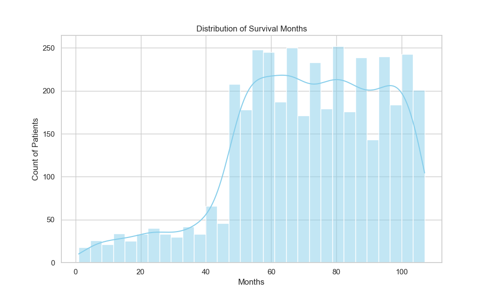
*Analyse de la distribution de survie des patients - Permet d'identifier les patterns de survie*

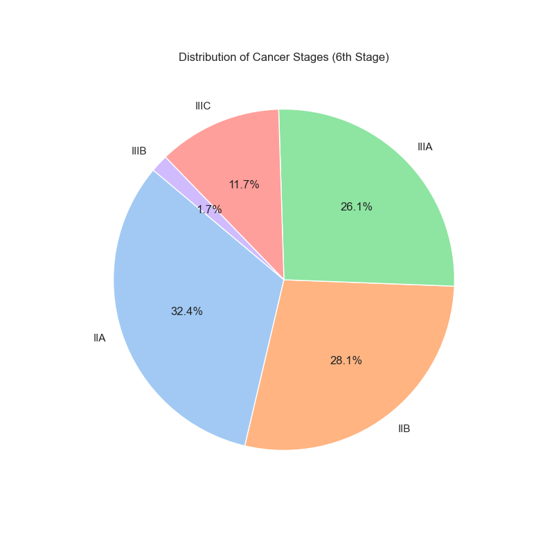
*Distribution des stades de cancer selon la classification 6th Stage*

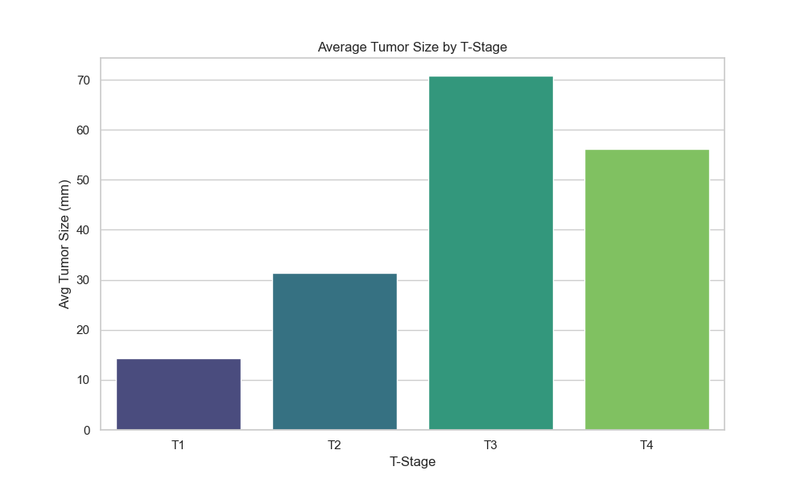
*Relation entre la taille moyenne des tumeurs et le stade T*

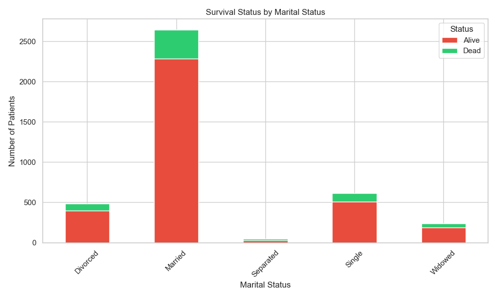
*Impact du statut marital sur les taux de survie*

### Dashboard Lung Survey

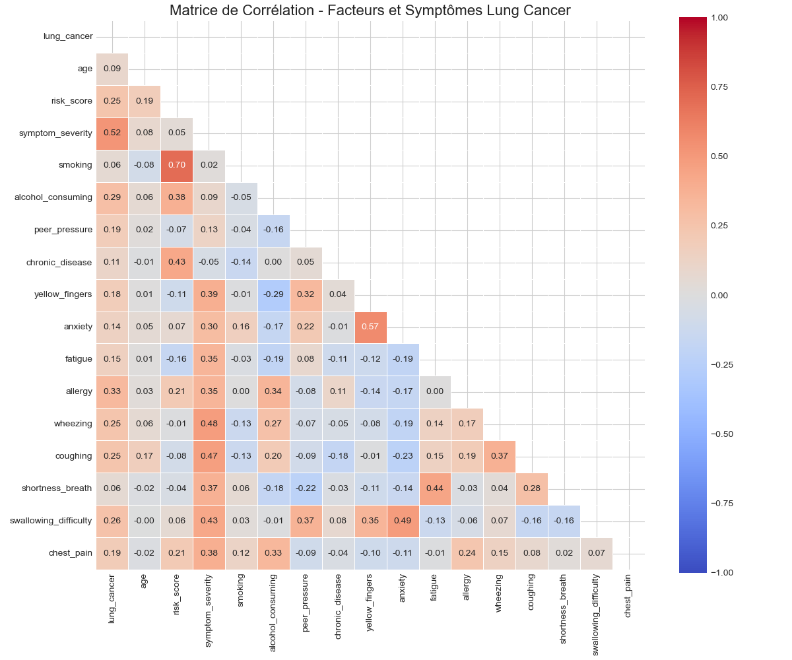
*Corrélations entre facteurs de risque et symptômes - Identification des relations clés*

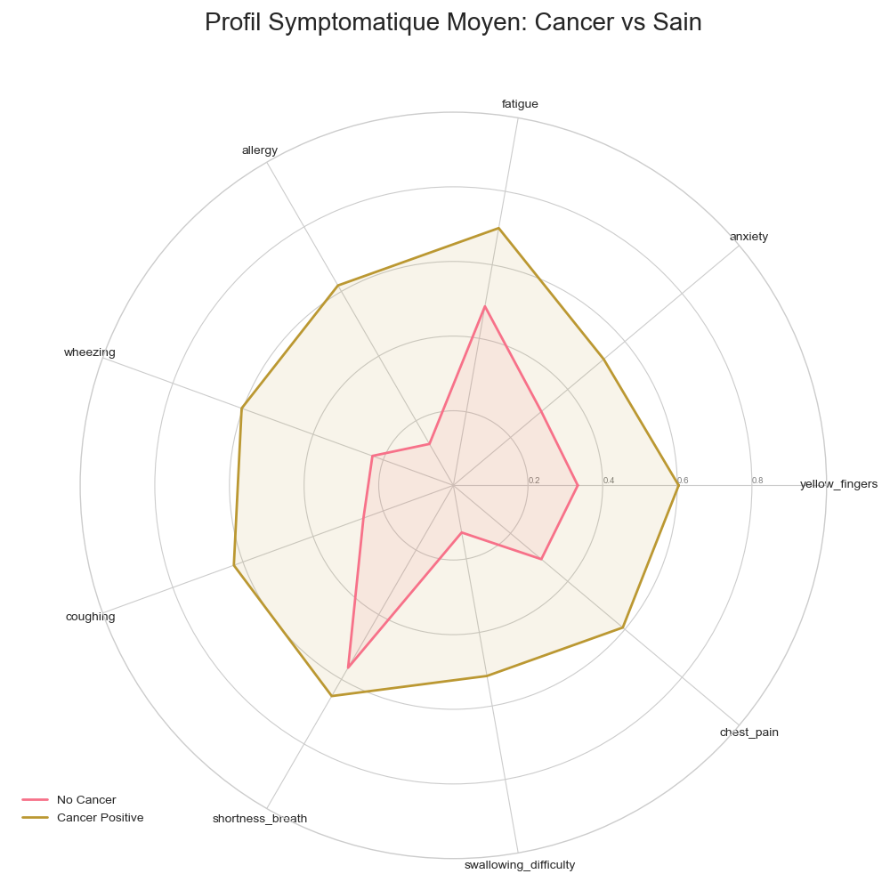
*Profil symptomatique comparatif: Patients avec cancer vs sans cancer*

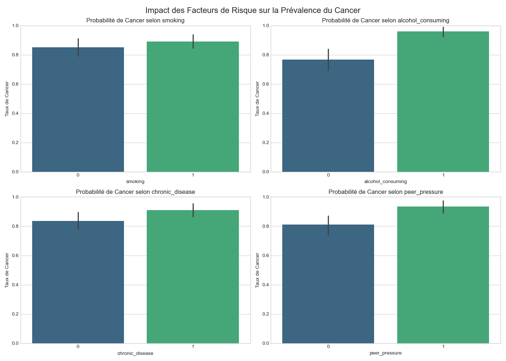
*Impact des différents facteurs de risque sur la prévalence du cancer*

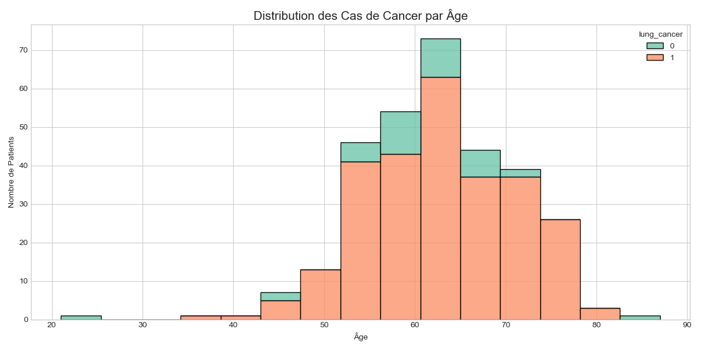
*Distribution des cas de cancer par tranche d'âge*

### Dashboard Breast Diagnostic

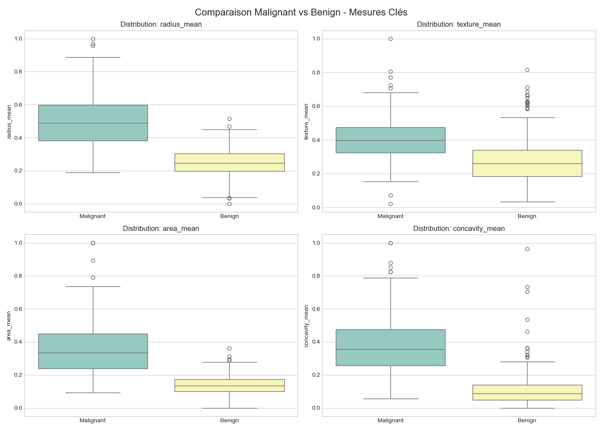
*Distribution des mesures morphologiques cellulaires par diagnostic*

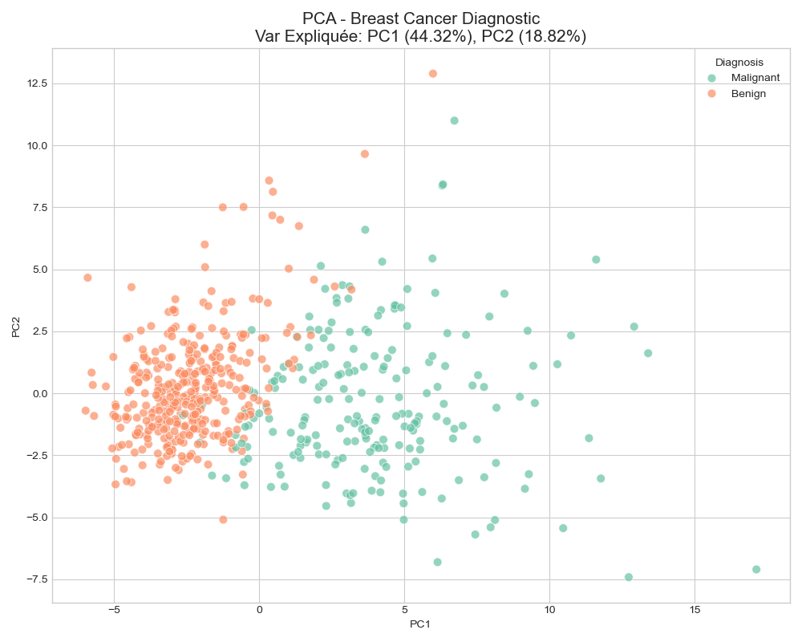
*Analyse en Composantes Principales - Réduction dimensionnelle*

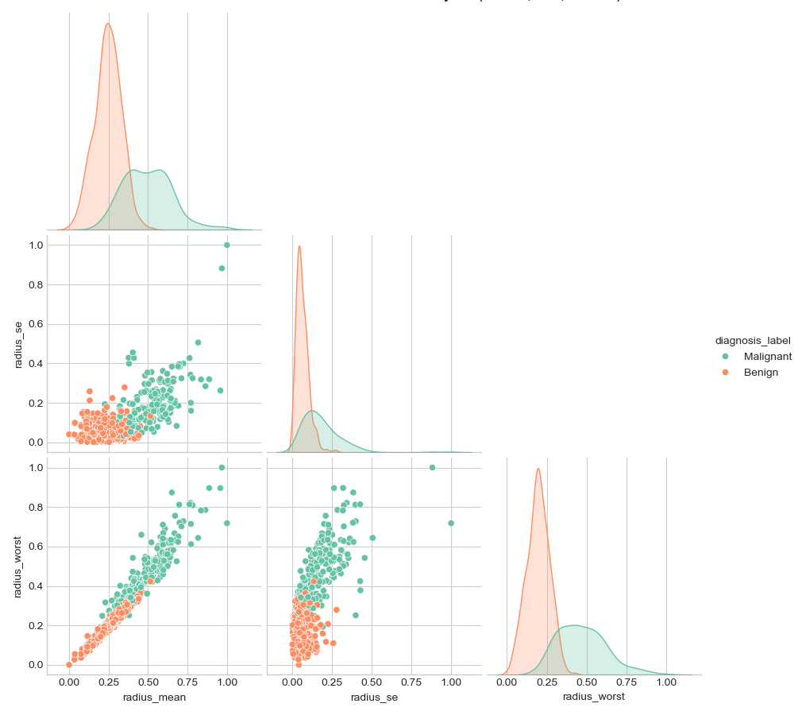
*Relations entre les différentes mesures cellulaires*

### Analyses Comparatives

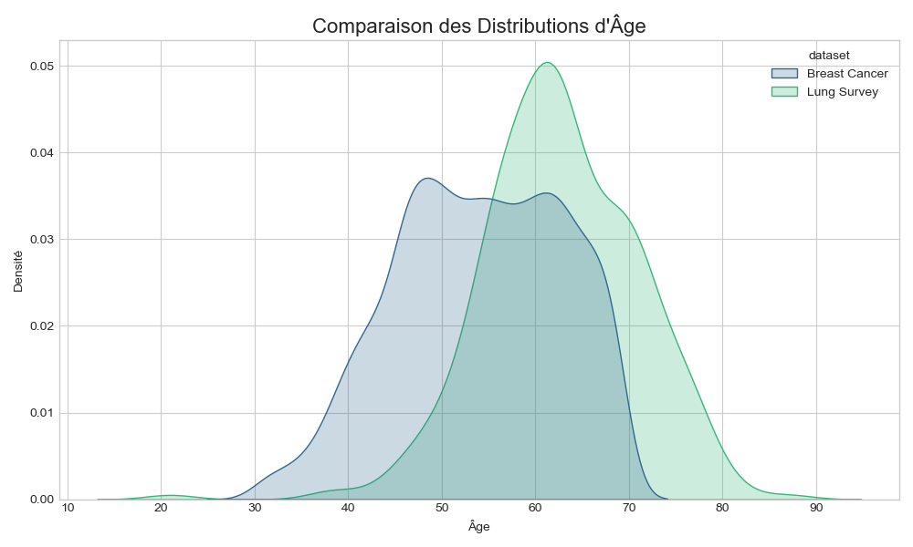
*Comparaison des distributions d'âge entre les différents datasets*

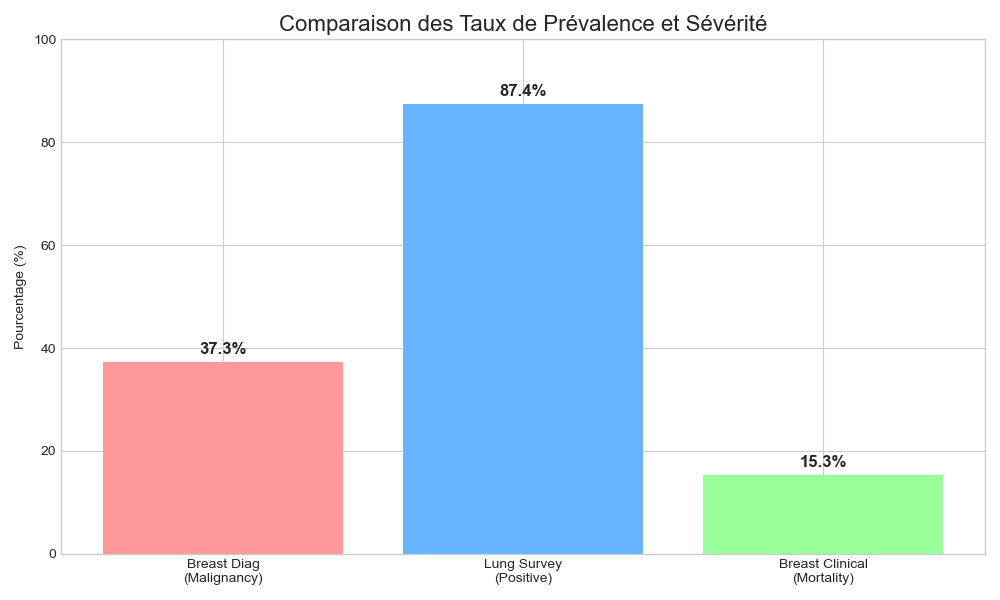
*Taux de prévalence et sévérité comparés entre les domaines*

##  Technologies Utilisées

### Base de Données
- **PostgreSQL**: SGBD relationnel avec support avancé
- **Schéma en Constellation**: Architecture optimale pour multi-domaines

### ETL & Transformation
- **Python**: Langage principal
- **PyGramETL**: Framework ETL Python
- **Pandas**: Manipulation de données
- **NumPy**: Calculs numériques

### Visualisation
- **Matplotlib**: Graphiques de base
- **Seaborn**: Visualisations statistiques avancées
- **Scikit-learn**: PCA et analyses ML

### Documentation
- **LaTeX**: Rapport technique professionnel

##  Résultats Obtenus

### Statistiques de Chargement
- **Breast Clinical**: 4,024 enregistrements chargés
- **Lung Survey**: 309 enregistrements chargés  
- **Breast Diagnostic**: 569 enregistrements chargés
- **Total**: 4,902 enregistrements dans le Data Warehouse

### Insights Majeurs
1. **Distribution d'âge**: Les populations des différents datasets présentent des profils démographiques distincts
2. **Facteurs de risque**: Le tabagisme et les maladies chroniques sont fortement corrélés au cancer pulmonaire
3. **Mesures diagnostiques**: Les features morphologiques permettent une discrimination efficace entre tumeurs bénignes et malignes
4. **Survie**: Le statut marital semble avoir un impact sur les taux de survie

##  Détails Techniques du Travail Effectué

### Phase 1: Conception du Schéma en Constellation

Le schéma a été conçu pour optimiser les requêtes analytiques tout en maintenant l'intégrité des données:

**1. Dimensions Partagées**
- `dim_date`: Dimension temporelle partagée par toutes les tables de faits
  - Attributs: date_id, full_date, year, month, quarter
  - Permet l'analyse temporelle cross-domaines

**2. Breast Clinical Domaine**
- `dim_patient`: Informations démographiques (âge, race, statut marital)
- `dim_diagnosis`: Stades tumoraux et caractéristiques histologiques
- `dim_outcome`: Résultats cliniques (statut de survie)
- `fact_breast_clinical`: Mesures cliniques et durée de survie

**3. Lung Survey Domaine**
- `dim_symptoms`: 9 symptômes binaires (doigts jaunes, anxiété, fatigue, etc.)
- `dim_risk_factors`: 4 facteurs de risque (tabagisme, alcool, maladies chroniques, pression sociale)
- `fact_lung_survey`: Données démographiques + scores calculés

**4. Breast Diagnostic Domaine**
- `dim_measurements`: 30+ mesures morphologiques cellulaires
- `dim_diagnosis_type`: Classification bénin/malin
- `fact_breast_diagnostic`: Liens entre mesures et diagnostic

**5. Optimisations**
- Index sur toutes les clés étrangères
- Vues matérialisées pour les requêtes fréquentes
- Contraintes d'intégrité référentielle

### Phase 2: Développement du Pipeline ETL

**Architecture ETL en 3 Tiers**

1. **Extraction**: Lecture des fichiers CSV sources avec Pandas
2. **Transformation**: Nettoyage, normalisation, création de features
3. **Chargement**: Insertion dans PostgreSQL via PyGramETL

**Script etl_master.py - Orchestrateur**
- Coordonne l'exécution séquentielle des 3 pipelines
- Gestion des erreurs avec rollback automatique
- Logging détaillé de chaque étape
- Rapport final avec statistiques de chargement
- Validation de l'intégrité des données

**Pipeline Breast Clinical (etl_pipeline.py)**
- Mapping des colonnes CSV vers les attributs de dimensions
- Gestion des valeurs manquantes et nettoyage des chaînes
- Utilisation de CachedDimension pour optimiser les performances
- Traitement par lots de 500 enregistrements
- Validation des contraintes d'intégrité

**Pipeline Lung Survey (etl_lung_survey.py)**
- Calcul du score de risque composite:
  - Formule: `(smoking + alcohol_consuming + chronic_disease + peer_pressure) / 4`
- Calcul de la sévérité des symptômes:
  - Moyenne des 9 indicateurs symptomatiques
- Normalisation des scores sur échelle 0-1
- Création de la vue `v_lung_survey_summary` pour l'analyse

**Pipeline Breast Diagnostic (etl_breast_diagnostic.py)**
- Normalisation MinMax des 30 mesures cellulaires
- Création de features composites:
  - `radius_texture_ratio`: radius_mean / texture_mean
  - `area_perimeter_ratio`: area_mean / perimeter_mean  
  - `worst_avg`: moyenne des 10 mesures "worst"
- Mapping complexe des colonnes (gestion des espaces dans les noms)
- Validation de la distribution des diagnostics (bénin vs malin)

### Phase 3: Développement des Dashboard

**Dashboard Breast Clinical (viz_breast_clinical.py)**
4 KPIs générés:

1. **Distribution de Survie**: Histogramme avec KDE des mois de survie
   - Identifie les patterns de survie
   - Permet d'analyser la mortalité

2. **Répartition des Stades**: Pie chart des stades 6th Edition
   - Visualise la distribution de la sévérité
   - Aide à la planification des ressources

3. **Taille par Stade T**: Barplot de la taille moyenne des tumeurs
   - Montre la progression tumorale
   - Corrélation taille-stade

4. **Survie par Statut Marital**: Stacked bar chart
   - Analyse l'impact social sur la survie
   - Potentiel facteur de soutien psychosocial

**Dashboard Lung Survey (viz_lung_survey.py)**
4 visualisations avancées:

1. **Matrice de Corrélation**: Heatmap des corrélations
   - Masque triangulaire supérieur pour lisibilité
   - Identification des relations facteurs-symptômes
   - Valeurs annotées avec formatage conditionnel

2. **Radar Chart**: Comparaison symptomatique
   - Profils moyens Cancer vs Sain
   - 9 axes pour les symptômes principaux
   - Visualisation intuitive des différences

3. **Facteurs de Risque**: 4 subplots
   - Impact individuel de chaque facteur
   - Probabilité de cancer par facteur
   - Palette viridis pour accessibilité

4. **Distribution par Âge**: Histogramme empilé
   - Distribution démographique des cas
   - Identification des groupes à risque

**Dashboard Breast Diagnostic (viz_breast_diagnostic.py)**
4 analyses morphologiques:

1. **Boxplots**: Distribution des mesures par diagnostic
   - Comparaison bénin vs malin
   - Identification des mesures discriminantes
   - Détection des outliers

2. **PCA**: Réduction dimensionnelle
   - Projection sur 2-3 composantes principales
   - Coloration par diagnostic
   - Visualisation de la séparation des classes

3. **Scatter Matrix**: Relations entre variables
   - Matrice de scatter plots
   - Histogrammes diagonaux
   - Identification des corrélations

4. **Violin Plots**: Distribution par caractéristique
   - Combinaison boxplot + kernel density
   - Analyse de la forme des distributions
   - Comparaison multi-variables

**Dashboard Comparatif (viz_comparative.py)**
2 analyses cross-domaines:

1. **Distribution d'Âge**: KDE plots comparés
   - Breast Clinical vs Lung Survey
   - Densités normalisées
   - Identification des différences démographiques

2. **Taux de Prévalence**: Bar chart comparatif
   - Breast Diagnostic (malignité)
   - Lung Survey (positivité)
   - Breast Clinical (mortalité)
   - Valeurs annotées en pourcentage

### Phase 4: Reporting Technique

**Rapport LaTeX (final_report.tex)**
- Structure académique professionnelle
- Sections: Introduction, Méthodologie, Résultats, Discussion
- Intégration des figures générées
- Bibliographie et références
- Format PDF pour distribution

**Documentation Complémentaire**
- Rapport détaillé "Oncological Intelligence Unified Data Platform"
- Analyse approfondie de l'architecture
- Recommandations pour déploiement production
- Guide d'utilisation et maintenance

##  Perspectives d'Évolution

### Améliorations Possibles
1. **Temps réel**: Intégration de streaming avec Apache Kafka
2. **ML Avancé**: Modèles prédictifs de survie et de risque
3. **Dashboard interactif**: Interface web avec Streamlit ou Dash
4. **Data Quality**: Contrôles automatiques de qualité des données
5. **Performance**: Partitionnement et matérialisation des vues

### Extensibilité
- Ajout de nouvelles sources de données oncologiques
- Intégration de données génomiques
- Système d'alertes automatiques
- Export vers des outils de BI (Power BI, Tableau)

##  Auteurs et Contribution

Ce projet a été développé dans le cadre d'une formation en Business Intelligence et Data Warehousing. Il démontre l'application pratique des concepts d'ETL, de schéma en constellation et d'analyse multi-sources dans le domaine médical.

##  Licence

Ce projet est à usage éducatif et de recherche. Les datasets utilisés sont disponibles publiquement pour la recherche médicale.
